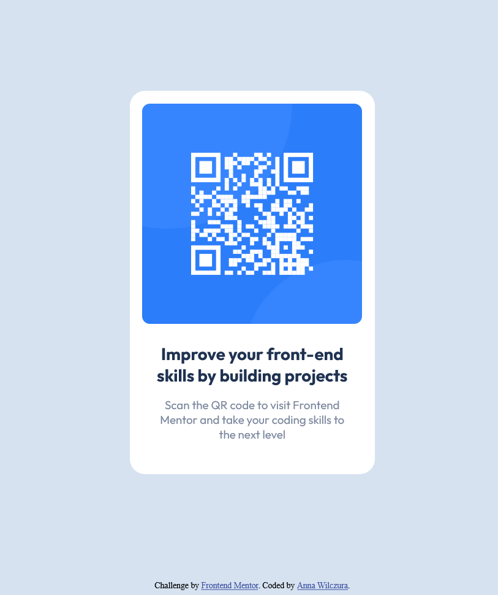

# Frontend Mentor - QR code component solution

This is a solution to the [QR code component challenge on Frontend Mentor](https://www.frontendmentor.io/challenges/qr-code-component-iux_sIO_H). Frontend Mentor challenges help you improve your coding skills by building realistic projects. 

## Table of contents

- [Overview](#overview)
  - [Screenshot](#screenshot)
  - [Links](#links)
- [My process](#my-process)
  - [Built with](#built-with)
  - [What I learned](#what-i-learned)
  - [Continued development](#continued-development)
  - [Useful resources](#useful-resources)
- [Author](#author)
- [Acknowledgments](#acknowledgments)

## Overview

### Screenshot



### Links

- Solution URL: [frontend-dev-qr-code.netlify.app](frontend-dev-qr-code.netlify.app)

## My process

### Built with

- HTML5
- CSS
- Flexbox

### What I learned

I learned how to divide content and easily resize fonts with use of CSS rem units. The biggest challenge was to keep the QR frame in the middle of a screen while changing its size ;) I achived that using Flexbox properties.

```css
.container {
    min-height: 100vh;
    display: flex;
    justify-content: center;
    align-items: center;
}
```
### Continued development

I'm going to:
- learn more about HTML tags to use block and line elements more consciously,
- practice Flexbox properties

### Useful resources

- [Resource 1](https://www.better.dev/centering-things-with-css-flexbox) - Centering the content with Flexbox very well explained.
- [Resource 2](https://css-tricks.com/snippets/css/a-guide-to-flexbox/) - Nice explanation of Flexbox with very useful drawings.

## Author

- [@Anq92](https://www.frontendmentor.io/profile/Anq92)
